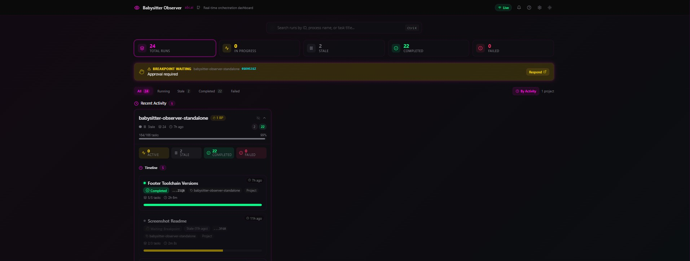
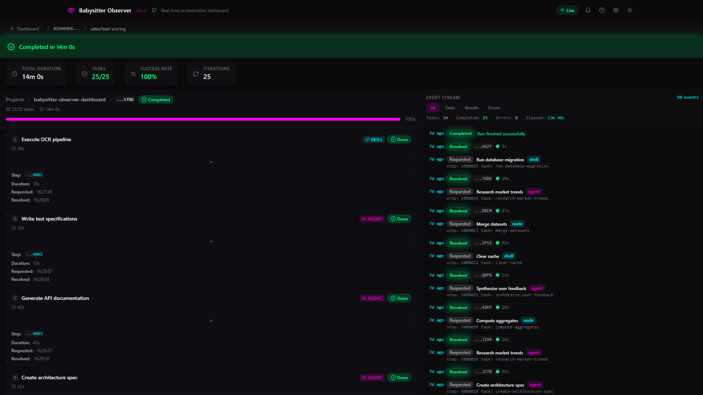

# @yoavmayer/babysitter-observer-dashboard

[](https://www.npmjs.com/package/@yoavmayer/babysitter-observer-dashboard)
[](https://opensource.org/licenses/MIT)
[](https://nodejs.org)

Real-time observability dashboard for [babysitter](https://github.com/a5c-ai/babysitter) orchestration runs.





## What is Babysitter Observer Dashboard?

Babysitter Observer Dashboard is a real-time browser-based monitoring UI for [babysitter](https://github.com/a5c-ai/babysitter) orchestration runs. If you use babysitter to orchestrate multi-step AI agent workflows, this dashboard gives you live visibility into what's happening across all your projects -- no more flying blind in the terminal. Point it at a directory, and it auto-discovers runs, streams updates to your browser, and lets you approve breakpoints without switching contexts.

## Prerequisites

- **Node.js >= 18** (LTS recommended)
- A project using [babysitter](https://github.com/a5c-ai/babysitter) with `.a5c/runs/` directories
- That's it -- zero config needed beyond that

## Features

- **Multi-project dashboard** -- auto-discovers `.a5c/runs/` directories across multiple projects and groups runs by project
- **Smart layout** -- active runs shown prominently; recently completed projects stay visible for a configurable recency window before moving to collapsible "Recent History"
- **Health cards** -- at-a-glance status cards showing active, completed, and failed runs per project with KPI metrics
- **Expanded project mini-dashboard** -- drill into any project to see runs organized into Active, Failed, and Completed sections with mini KPI pills
- **Pipeline visualization** -- step-by-step view of task pipelines with parallel group rendering, duration tracking, and error details
- **Real-time event stream** -- Server-Sent Events (SSE) push updates to the browser the instant a journal file changes on disk
- **Breakpoint UI** -- approve or reject breakpoints directly from the dashboard without touching the terminal
- **Run detail view** -- deep-dive into any run with agent details, timing breakdowns, logs, and raw JSON inspection
- **Run retention** -- configurable retention window (default 30 days) filters old runs from the dashboard for performance at scale
- **Keyboard shortcuts** -- navigate between runs and projects without leaving the keyboard
- **Dark and light themes** -- toggle between dark and light mode; persisted in the registry file
- **Configurable polling** -- adaptive smart-polling with backoff; poll interval is tunable via CLI, environment, or the settings panel
- **Editable settings panel** -- add or remove watch sources, change poll interval, set retention window, and switch themes from the UI (persisted to `~/.a5c/observer.json`)
- **Resilient networking** -- automatic retry with exponential backoff for transient API failures and AbortSignal integration
- **CLI launcher** -- single command to start the dashboard pointing at any directory
- **Lightweight digest endpoint** -- efficient polling endpoint that returns only run metadata, avoiding full payload transfers
- **Global search** -- search runs by ID, title, or project name across all projects (Ctrl+K)
- **Sort and filter tabs** -- filter by All, Active, Completed, or Failed runs; sort by most recent activity
- **Project visibility** -- hide/show projects from the settings panel without removing watch sources
- **WCAG AA accessibility** -- minimum 12px text sizes, 4.5:1+ contrast ratios in both light and dark themes

## Quick Start

### Option 1: Run directly with npx

```bash
npx -y @yoavmayer/babysitter-observer-dashboard
```

### Option 2: Install globally

```bash
npm install -g @yoavmayer/babysitter-observer-dashboard
babysitter-observer-dashboard
```

### Option 3: Add as a dev dependency

```bash
npm install --save-dev @yoavmayer/babysitter-observer-dashboard
```

Then add a script to your `package.json`:

```json
{
  "scripts": {
    "observe": "babysitter-observer-dashboard --watch-dir ."
  }
}
```

Or run it directly with npx without adding a script:

```bash
npx babysitter-observer-dashboard --watch-dir .
```

The dashboard opens at [http://localhost:3000](http://localhost:3000) by default.

## CLI Reference

```
babysitter-observer-dashboard [options]
```

| Flag | Type | Default | Description |
|------|------|---------|-------------|
| `--port <number>` | number | `3000` | Port the dashboard listens on |
| `--watch-dir <path>` | string | current working directory | Directory to watch for `.a5c/runs/` subdirectories |
| `--poll-interval <ms>` | number | `2000` | Polling interval in milliseconds |
| `--theme <dark\|light>` | string | `dark` | Default UI color theme |
| `--dev` | boolean | `false` | Run in dev mode (`next dev`) instead of production mode (`next start`) |
| `--version`, `-v` | -- | -- | Show version number and exit |
| `--help`, `-h` | -- | -- | Show help message and exit |

### Examples

```bash
# Watch a specific project directory on a custom port
babysitter-observer-dashboard --port 3002 --watch-dir /home/user/projects

# Light theme
babysitter-observer-dashboard --theme light

# Fast polling for latency-sensitive workflows
babysitter-observer-dashboard --poll-interval 500
```

### Environment Variable Mapping

CLI flags map to environment variables with the following precedence (highest to lowest):

1. Registry file (`~/.a5c/observer.json`)
2. CLI flags / `OBSERVER_*` environment variables
3. Legacy environment variables (`PORT`, `WATCH_DIR`, `POLL_INTERVAL`, `THEME`)
4. Built-in defaults

| CLI Flag | Environment Variable |
|----------|---------------------|
| `--port` | `OBSERVER_PORT` |
| `--watch-dir` | `OBSERVER_WATCH_DIR` |
| `--poll-interval` | `OBSERVER_POLL_INTERVAL` |
| `--theme` | `OBSERVER_DEFAULT_THEME` |

## Configuration

All configuration can be set via environment variables, the CLI, or the in-dashboard settings panel.

Copy `.env.example` to `.env` and customize:

```bash
cp .env.example .env
```

| Variable | Default | Description |
|----------|---------|-------------|
| `PORT` | `3000` | Port the dashboard listens on |
| `WATCH_DIR` | (current working directory) | Single directory to watch for `.a5c/runs/` |
| `WATCH_DIRS` | -- | Comma-separated list of directories to watch |
| `POLL_INTERVAL` | `2000` | Polling interval in milliseconds for run updates |
| `THEME` | `dark` | Default color theme (`dark` or `light`) |
| `OBSERVER_REGISTRY` | `~/.a5c/observer.json` | Path to the persistent config registry file |
| `OBSERVER_PORT` | -- | Port override (takes priority over `PORT`) |
| `OBSERVER_WATCH_DIR` | -- | Watch directory set by the CLI |
| `OBSERVER_POLL_INTERVAL` | -- | Poll interval override (takes priority over `POLL_INTERVAL`) |
| `OBSERVER_DEFAULT_THEME` | -- | Theme override (takes priority over `THEME`) |
| `OBSERVER_STALE_THRESHOLD_MS` | `3600000` | Time in milliseconds after which an inactive run is considered stale |
| `OBSERVER_RECENT_WINDOW_MS` | `14400000` | Time in milliseconds that recently completed projects stay in the Active section (default: 4 hours) |
| `OBSERVER_RETENTION_DAYS` | `30` | Number of days to retain completed/failed runs in the dashboard (1-365) |
| `BABYSITTER_CLI` | `babysitter` | Path to the babysitter CLI binary (used for breakpoint resolution) |

### Registry File

The observer persists user-configured settings to `~/.a5c/observer.json`. This file is created and updated when you change settings from the dashboard UI or via the `POST /api/config` endpoint. It stores:

- **sources** -- watched directories with path, search depth, and optional label
- **pollInterval** -- polling interval override
- **theme** -- color theme preference
- **staleThresholdMs** -- time (in milliseconds) after which an inactive run is marked stale (default: 3600000)
- **recentCompletionWindowMs** -- time (in milliseconds) that recently completed projects stay in the Active section (default: 14400000 / 4 hours)
- **retentionDays** -- number of days to retain completed/failed runs in the dashboard (default: 30)

## How It Works

```
  Filesystem                    Observer Server                   Browser
  ----------                    ---------------                   -------
  .a5c/runs/                                                         |
    <runId>/          --(fs watch)-->  Watcher                       |
      journal/                           |                           |
        0001.json                   In-memory cache                  |
        0002.json                        |                           |
      tasks/                        Next.js API routes               |
        <effectId>/                      |                           |
          ...               SSE stream --+--> /api/stream ---------> EventSource
                            REST API   --+--> /api/runs   ---------> Dashboard UI
                                       --+--> /api/digest ---------> Smart Polling
```

1. **Watch** -- A file-system watcher monitors configured directories for `.a5c/runs/` folders. It recursively scans up to a configurable depth (default 2 levels).
2. **Parse** -- When journal files change, the parser reads NDJSON journal entries and constructs run/task state in an in-memory cache.
3. **Serve** -- A Next.js 14 App Router application exposes both REST endpoints and an SSE stream.
4. **Display** -- The React dashboard connects via SSE for instant push updates and falls back to adaptive polling. Runs are grouped by project, with health cards, pipeline visualization, and breakpoint approval built in.

## API Reference

All endpoints include `Cache-Control: no-cache, no-store` headers and return JSON unless noted otherwise.

| Method | Endpoint | Description |
|--------|----------|-------------|
| `GET` | `/api/test` | Health check. Returns `"test"` with status 200. |
| `GET` | `/api/config` | Returns the current merged configuration (sources, port, pollInterval, theme). |
| `POST` | `/api/config` | Updates the registry file with new sources, pollInterval, and/or theme. |
| `GET` | `/api/digest` | Lightweight run digests for all discovered runs. Returns `{ runs: RunDigest[] }`. |
| `GET` | `/api/runs` | Lists all runs. Supports query parameters: `mode=projects` (returns project summaries), `project=<name>` (filters by project), `limit`, `offset`, `search`, `status`. |
| `GET` | `/api/runs/:runId` | Full detail for a single run. Supports `?maxEvents=<n>` (default 50) to limit events in the response. |
| `GET` | `/api/runs/:runId/events` | Paginated journal events. Supports `?limit=<n>&offset=<n>`. |
| `GET` | `/api/runs/:runId/tasks/:effectId` | Full task detail including input, result, stdout, stderr, and breakpoint data. |
| `POST` | `/api/runs/:runId/tasks/:effectId/resolve` | Resolve a breakpoint. Body: `{ "approved": true/false, "value": "optional feedback" }`. |
| `GET` | `/api/stream` | SSE event stream. Emits `connected`, `update`, `new-run`, and `error` events. Sends keep-alive pings every 15 seconds. |

## Development

### Prerequisites

- Node.js 18+ (LTS recommended)
- npm 9+

### Setup

```bash
npm install
```

### Run in Development Mode

```bash
npm run dev
```

The dashboard starts at [http://localhost:3000](http://localhost:3000).

To point at a specific watch directory:

```bash
npm run dev:cli -- --watch-dir /path/to/project
```

### Build for Production

```bash
npm run build
npm start
```

### Project Structure

```
src/
  app/                          # Next.js App Router pages
    page.tsx                    # Dashboard home (project list)
    runs/[runId]/page.tsx       # Run detail view
    api/
      config/route.ts           # GET/POST observer configuration
      digest/route.ts           # Lightweight polling digest
      runs/route.ts             # List runs, filter by project
      runs/[runId]/route.ts     # Single run detail
      runs/[runId]/events/      # Journal events for a run
      runs/[runId]/tasks/       # Task detail + breakpoint resolve
      stream/route.ts           # SSE event stream
      test/route.ts             # Health check endpoint
  components/
    breakpoint/                 # Breakpoint approval UI
    dashboard/                  # Dashboard cards, lists, project sections
    details/                    # Run detail panels (agent, timing, logs, JSON)
    events/                     # Real-time event stream display
    notifications/              # Toast and notification system
    pipeline/                   # Pipeline visualization (step cards, parallel groups)
    providers/                  # Context providers (event stream)
    shared/                     # Reusable UI primitives (badges, pills, modals)
    ui/                         # Base UI components (button, card, tabs, etc.)
  hooks/
    use-breakpoint-resolve.ts   # Breakpoint approval/rejection
    use-event-stream.ts         # SSE connection management
    use-keyboard.ts             # Keyboard shortcut bindings
    use-notifications.ts        # Browser + in-app notifications
    use-polling.ts              # Generic polling hook
    use-project-runs.ts         # Paginated runs for a project
    use-projects.ts             # Project summary list
    use-run-detail.ts           # Single run detail fetching
    use-smart-polling.ts        # Adaptive polling with backoff
  lib/
    cn.ts                       # Tailwind class merge utility
    config.ts                   # Server-side config loading and discovery
    error-handler.ts            # Centralized error normalization
    fetcher.ts                  # Resilient fetch with retry and abort
    parser.ts                   # Journal event parsing
    run-cache.ts                # In-memory run cache with retention filtering
    server-init.ts              # Server initialization (watcher + cache)
    utils.ts                    # Formatting helpers (duration, timestamps, IDs)
    watcher.ts                  # File-system watcher for run directories
  types/
    index.ts                    # Core type definitions
    breakpoint.ts               # Breakpoint-related types
```

## Testing

### Unit Tests

Unit tests use [Vitest](https://vitest.dev/) with [React Testing Library](https://testing-library.com/docs/react-testing-library/intro/) and [MSW](https://mswjs.io/) for API mocking.

```bash
# Run all unit tests once
npm test

# Run in watch mode during development
npm run test:watch

# Generate coverage report
npm run test:coverage
```

### End-to-End Tests

E2E tests use [Playwright](https://playwright.dev/) and run against a live dev server with fixture data.

```bash
# Install Playwright browsers (first time only)
npx playwright install

# Run E2E tests
npx playwright test

# Run with UI mode for debugging
npx playwright test --ui

# View the HTML report after a run
npx playwright show-report
```

The Playwright configuration (`playwright.config.ts`) automatically starts a dev server pointed at `e2e/fixtures/runs/` so tests run against deterministic data.

## Troubleshooting

### Port already in use

If you see `Error: listen EADDRINUSE :::3000`, another process is using the default port. Either stop the other process or start the observer on a different port:

```bash
babysitter-observer-dashboard --port 3001
```

### Permission errors on global install

On macOS/Linux, global npm installs may require elevated permissions. If you see `EACCES` or permission-denied errors, try one of these approaches:

**Recommended: use npx instead (no global install needed):**

```bash
npx -y @yoavmayer/babysitter-observer-dashboard
```

**Alternative: configure npm to use a user-writable directory:**

```bash
mkdir -p ~/.npm-global
npm config set prefix "~/.npm-global"
export PATH=~/.npm-global/bin:$PATH
```

Then retry the global install:

```bash
npm install -g @yoavmayer/babysitter-observer-dashboard
```

**Alternative: use sudo (not recommended):**

```bash
sudo npm install -g @yoavmayer/babysitter-observer-dashboard
```

### No runs appearing in the dashboard

1. **Verify the watch directory.** The observer looks for `.a5c/runs/` subdirectories within the configured watch path. Run the observer with an explicit `--watch-dir` pointing to the parent of your project:

   ```bash
   babysitter-observer-dashboard --watch-dir /path/to/your/project
   ```

2. **Check directory structure.** The expected layout is:

   ```
   <project>/
     .a5c/
       runs/
         <runId>/
           journal/
             0001.json
   ```

3. **Increase search depth.** By default the observer scans 2 levels deep. If your `.a5c/runs/` directories are nested deeper, update the source depth in the settings panel or via `POST /api/config`.

### WSL2 file-watching delays

When running the observer on Windows but watching files on a WSL2 filesystem (or vice versa), cross-filesystem events may be delayed or missed entirely. Workarounds:

- Run the observer inside the same environment as your babysitter processes (both in WSL, or both on the Windows side).
- Lower the poll interval to compensate: `babysitter-observer-dashboard --poll-interval 1000`.

### Registry file permissions

The observer reads and writes `~/.a5c/observer.json`. If this file or directory is not writable, settings changes from the UI will fail silently. Ensure the `~/.a5c/` directory exists and is writable:

```bash
mkdir -p ~/.a5c
```

### Breakpoint resolution fails

Breakpoint approval/rejection depends on the `babysitter` CLI being available on your PATH. If the CLI is installed elsewhere, set the `BABYSITTER_CLI` environment variable:

```bash
BABYSITTER_CLI=/usr/local/bin/babysitter babysitter-observer-dashboard
```

## Known Limitations

This is version `0.8.0`. The API and configuration format may change between minor versions.

- **Local only** -- The observer reads run data from the local filesystem. There is no remote/cloud mode.
- **No authentication** -- The dashboard and API endpoints are unauthenticated. Do not expose to untrusted networks.
- **No persistent storage** -- All run state is held in an in-memory cache rebuilt from journal files on startup. Restarting the server reloads from disk.
- **WSL2 file-watching latency** -- On Windows Subsystem for Linux 2, cross-filesystem file-system events may be delayed. The observer compensates with polling but updates may lag behind native Linux or macOS.
- **Single-instance only** -- Running multiple observer instances watching the same directories is untested and may produce duplicate SSE events.
- **Large run directories** -- Discovery scans are cached and debounced (filesystem rescans happen at most once per 60 seconds, triggered by the watcher on new-run events). The digest API reads purely from the in-memory cache with zero filesystem I/O. Thousands of run directories are handled efficiently, though initial startup may take a few seconds for the first scan.
- **Runs visible only after first write to `.a5c/runs/`** -- The dashboard monitors `.a5c/runs/` directories for run data. Regular Claude Code terminal sessions that do not use babysitter orchestration will not appear on the dashboard. A run becomes visible only after the babysitter runtime writes its first journal entry to `.a5c/runs/<runId>/journal/`. This means there is a brief delay between starting a babysitter process and seeing it on the dashboard.
- **No run deletion or archival** -- The observer is read-only (except for breakpoint resolution). There is no UI to delete, archive, or export runs.
- **Browser notifications** -- Notification support depends on browser permissions and may not work in all environments.


## License

[MIT](https://opensource.org/licenses/MIT)
