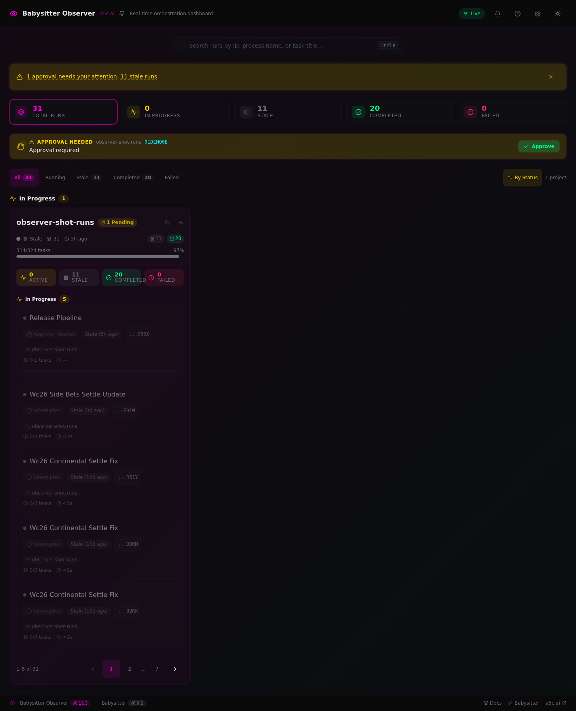
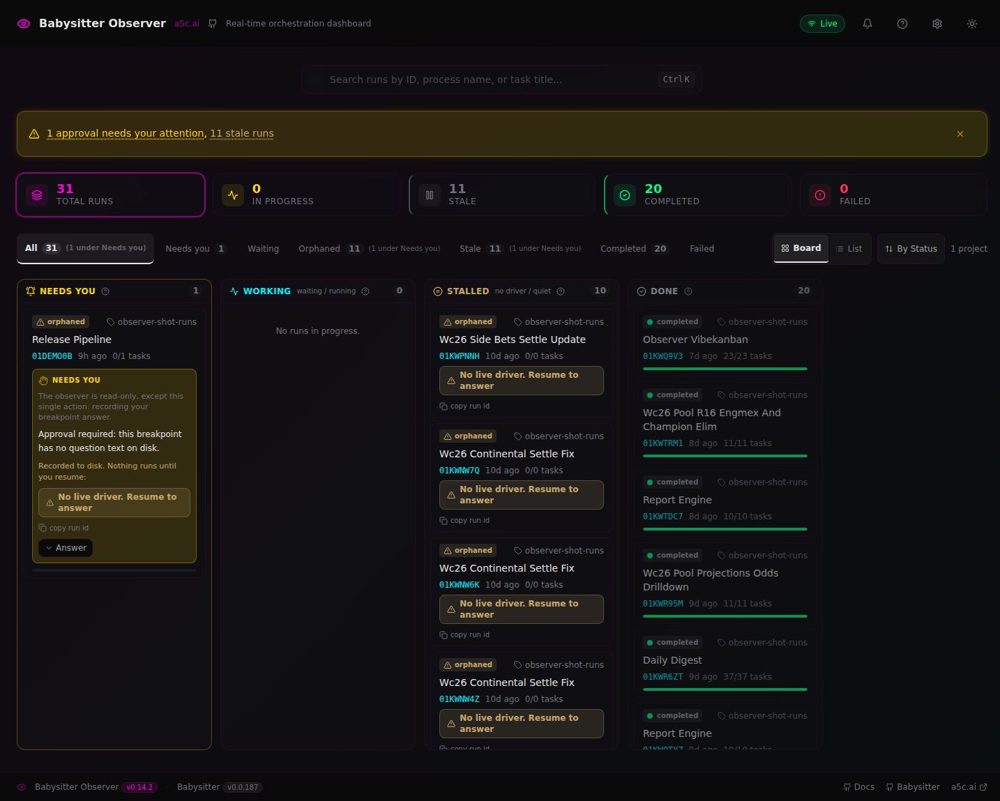
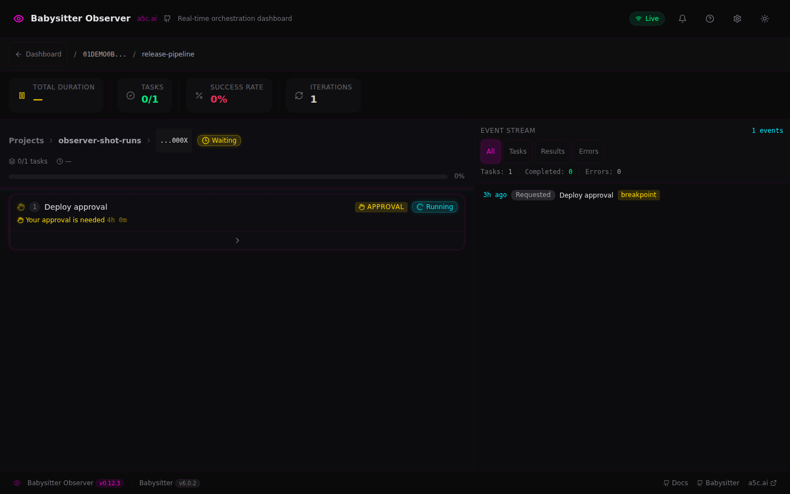
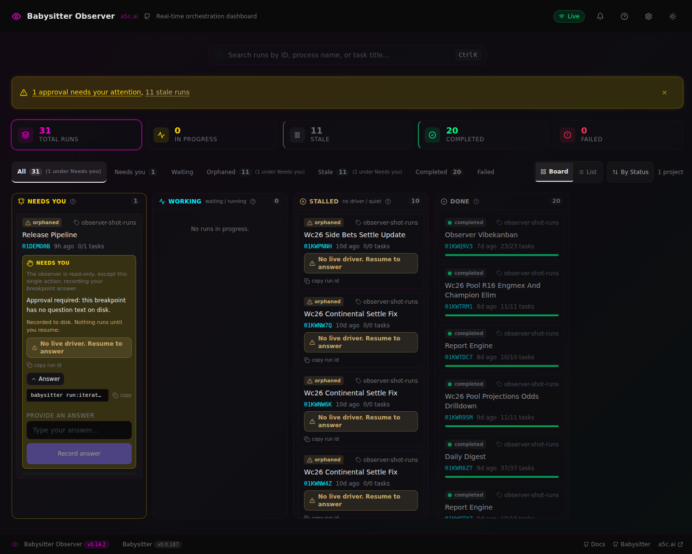
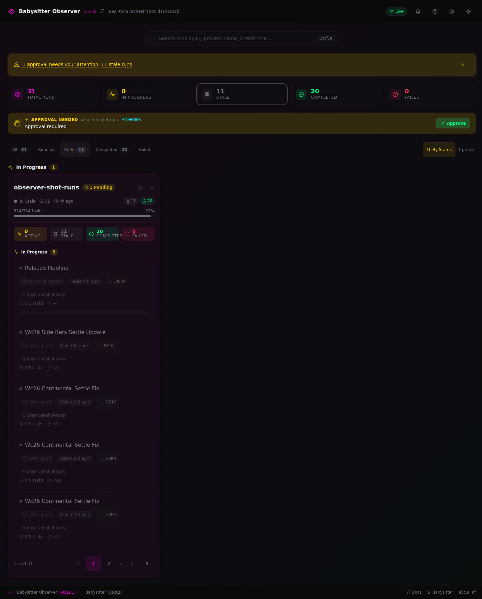
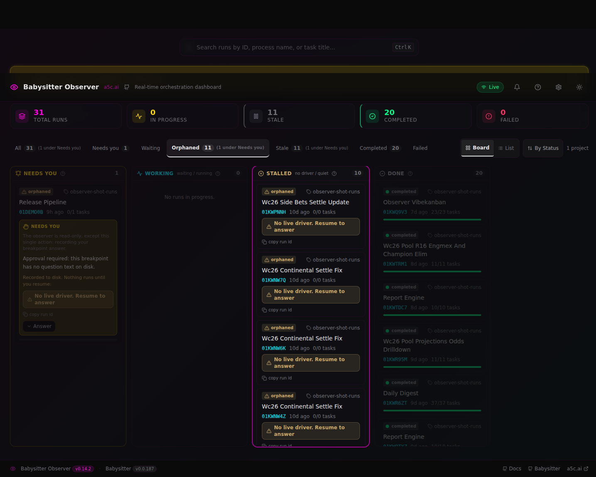
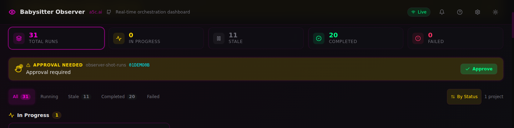
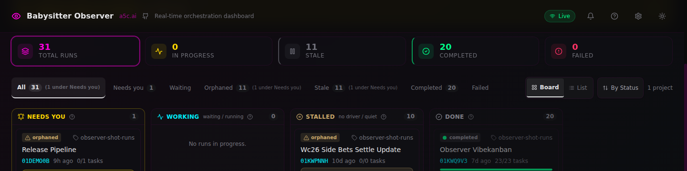
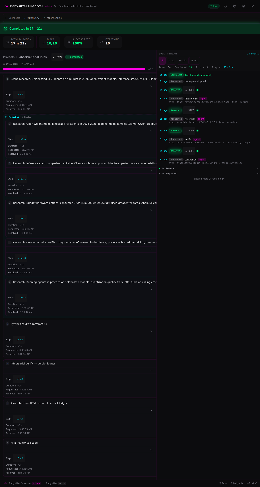
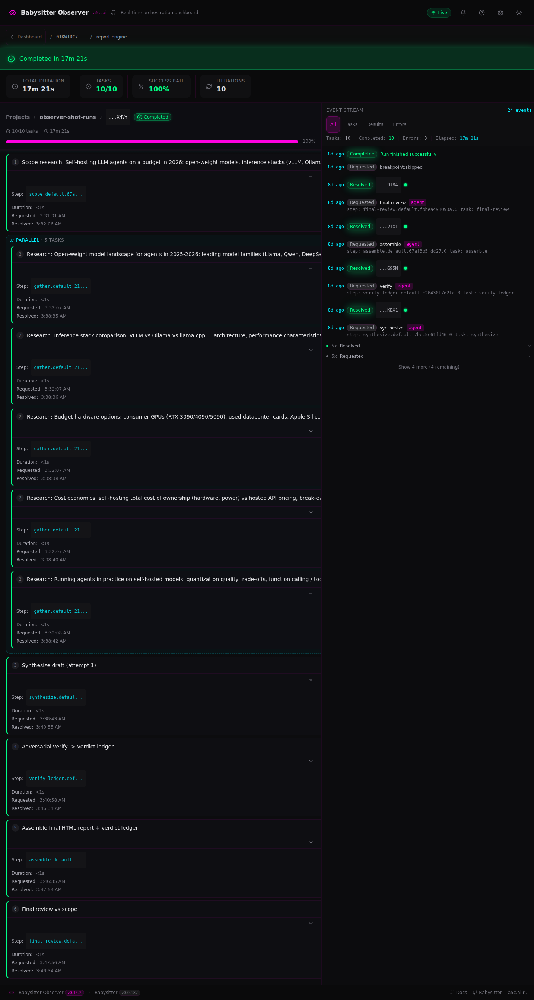

# v0.12.3 → v0.14.2 — what changed, visually

Method: the same curated public run set, rendered side by side by the two npm releases (`@yoavmayer/babysitter-observer-dashboard@0.12.3` vs `@0.14.2`).

## 1. Home / triage layout

v0.12.3 opens on a flat project card with a paginated run list — every run looks the same until you read it. v0.14.2 opens on a 4-column kanban board (Needs you / Working / Stalled / Done) that triages the same 31 runs by what actually needs the owner.

| v0.12.3 | v0.14.2 |
| --- | --- |
|  |  |

## 2. Breakpoint answering

v0.12.3 shows a passive "approval needed" row with no way to answer from the dashboard. v0.14.2 has a full Answer panel: read-only contract text, an inert copyable `babysitter run:iterate` command, and a Record answer submit that writes the answer to disk.

| v0.12.3 | v0.14.2 |
| --- | --- |
|  |  |

## 3. Status honesty

v0.12.3 files dead runs under "In Progress" with mixed labels. v0.14.2 marks them with explicit orphaned chips, a no-driver Stalled column, resume banners, and reconciled counts.

| v0.12.3 | v0.14.2 |
| --- | --- |
|  |  |

## 4. KPI / filter row

The KPI numbers are the same on both versions; v0.14.2 adds Needs-you / Waiting / Orphaned pills with reconciliation notes and a Board/List toggle.

| v0.12.3 | v0.14.2 |
| --- | --- |
|  |  |

## 5. Run detail page

v0.14.2 shows readable step names instead of truncated hex ids and adds completed-state accent bars per task; layout and event stream otherwise identical.

| v0.12.3 | v0.14.2 |
| --- | --- |
|  |  |
